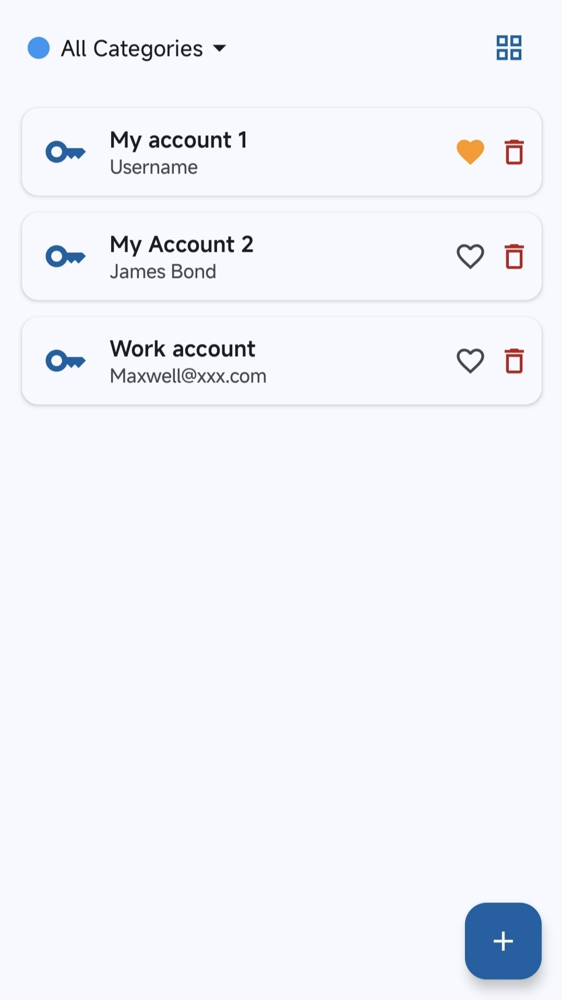
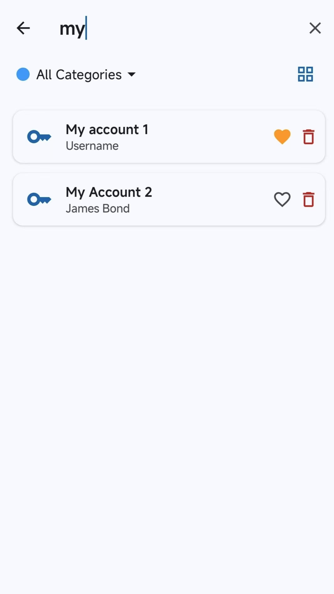
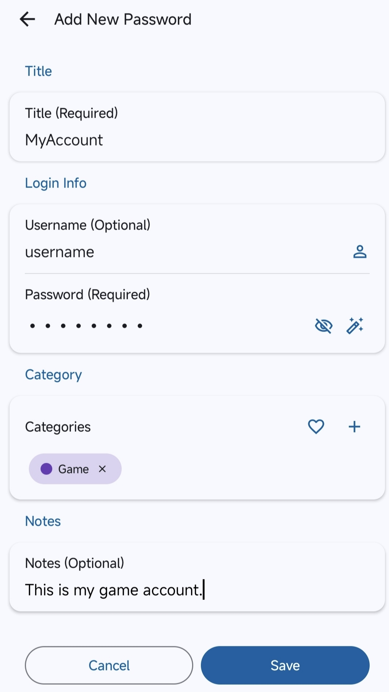
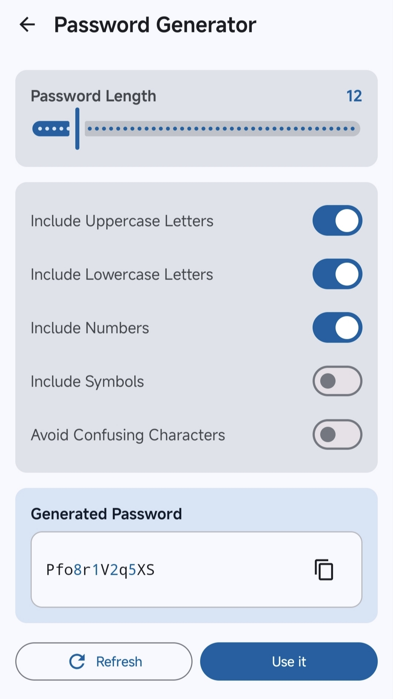
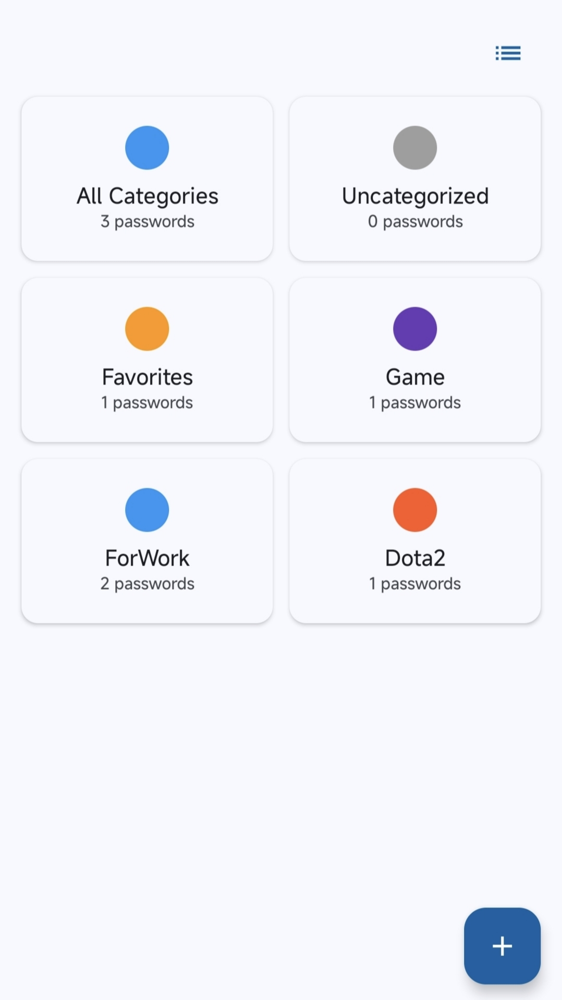
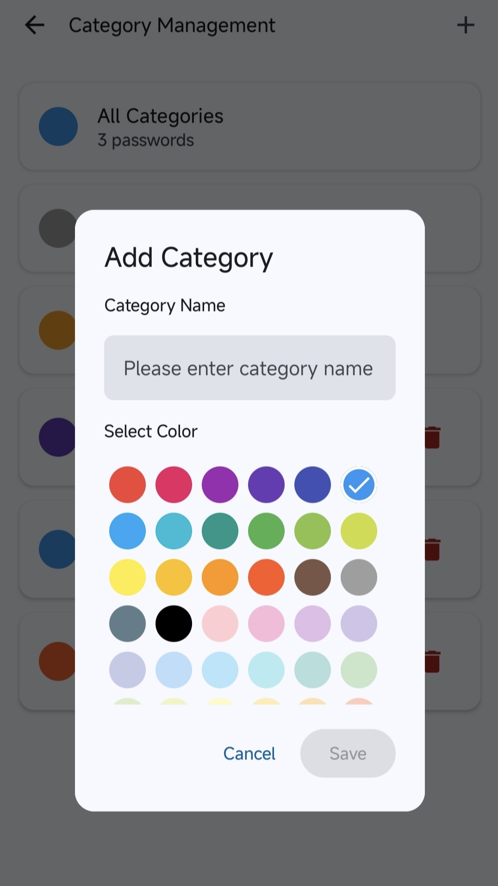
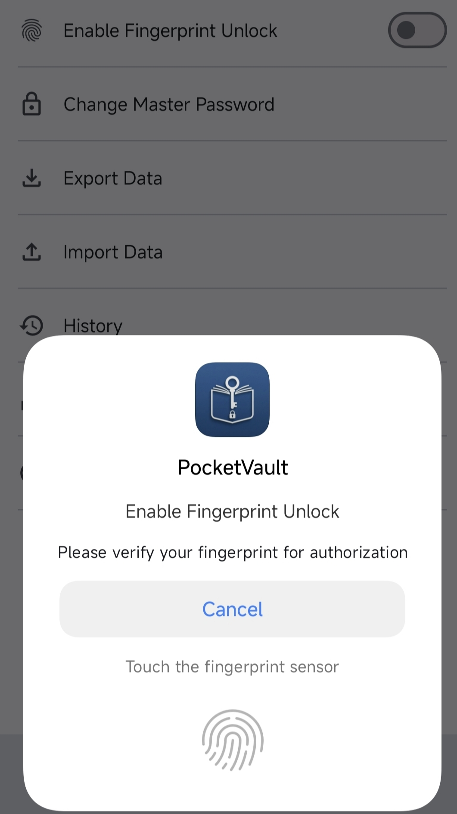

<p align="center">
  
</p>

<p align="center">
  <strong>A strictly offline, transparent, open-source password manager for Android</strong>
</p>

<p align="center">
  <a href="https://github.com/greyfreedom/PocketVault/actions/workflows/ci.yml"></a>
  <a href="https://github.com/greyfreedom/PocketVault/tags"></a>
  <a href="./LICENSE"></a>
  <a href="./app/build.gradle.kts"></a>
  <a href="./SECURITY.md"></a>
</p>

<p align="center">
  <a href="https://play.google.com/store/apps/details?id=com.turisla.hellopocket"></a>
</p>

<p align="center">
  <strong>English</strong> · <a href="README.zh-CN.md">简体中文</a> ·
  <a href="../../releases">GitHub Releases</a> ·
  <a href="docs/privacy_policy.html">Privacy</a> · <a href="SECURITY.md">Security</a> ·
  <a href="CONTRIBUTING.md">Contributing</a> · <a href="LICENSE">Apache-2.0</a>
</p>

---

PocketVault is a local Android password manager. It does not request `android.permission.INTERNET`, contains no analytics, advertising, telemetry, or crash-reporting SDK, and has no PocketVault account or remote backend.

Vault data is encrypted and processed on the device. Data leaves the app only when the user explicitly exports or shares a backup through an Android system destination.

> [!IMPORTANT]
> Open source and offline operation reduce risk but do not guarantee absolute security. Read the [security model and limitations](#security-model-and-limitations) and [SECURITY.md](SECURITY.md) before relying on it for sensitive data.

> [!NOTE]
> The strict-offline declarations in this repository describe version 2.4.0 and later. During the store rollout, Google Play may temporarily offer an earlier version; check the installed version and its corresponding source tag. See the [changelog](CHANGELOG.md) for the transition.

> [!WARNING]
> Version 2.5.0 accepts only the current authenticated V2 vault format. V1 vaults and early V2 vaults that lack current integrity, binding, or KDF metadata are rejected instead of being migrated in place. Before updating an older installation, unlock it with 2.4.0 and export a fresh `.hpb` backup. Keep the original data and verify the new backup before uninstalling or replacing 2.4.0.

## Features

- **Strictly offline** — no Internet permission, Firebase, advertising, usage analytics, or remote logging.
- **Passwords and secure notes** — store credentials, notes, categories, favorites, and encrypted attachments locally.
- **TOTP codes** — add entries manually or scan a QR code locally with the optional camera permission.
- **Local organization** — categories, favorites, list/grid layouts, and a dedicated search screen covering titles, accounts, password notes, and secure-note content.
- **Password generator** — configurable length, character sets, confusing-character exclusion, and passphrases.
- **Biometric convenience unlock** — protected by a local Android Keystore wrapping key.
- **Backup and restore** — encrypted import/export plus a bounded automatic history of up to 5 backups and 1 GiB total.
- **Sensitive-screen protection** — global `FLAG_SECURE`, background auto-lock, sensitive clipboard marking, and timed clearing.
- **Seven languages** — English, Simplified Chinese, Spanish, Hindi, Korean, Portuguese, and Vietnamese.

## Screenshots

The screenshots contain demonstration data only. Click any screenshot to open the original image from [`pictures/en`](pictures/en/).

<p align="center">
  <a href="./pictures/en/listpass.jpeg"></a>
  <a href="./pictures/en/search.jpeg"></a>
  <a href="./pictures/en/addpass.jpeg"></a>
  <a href="./pictures/en/gene.jpeg"></a>
</p>

<p align="center">
  <a href="./pictures/en/listcategory.jpeg"></a>
  <a href="./pictures/en/category.jpeg"></a>
  <a href="./pictures/en/fingerprint.jpeg"></a>
</p>

## Security design

PocketVault uses a master-password-wrapped random data key:

1. A new vault receives a random salt and a random Google Tink `StreamingAead` keyset.
2. PBKDF2-HMAC-SHA256 derives a key-encryption key from the master password. New and re-keyed vaults use 600,000 iterations, and supported vault configurations must declare at least that work factor.
3. The derived key wraps the random keyset. The master password, derived key, and plaintext keyset are not persisted.
4. Passwords, categories, TOTP entries, manifests, and attachments are encrypted with Google Tink Streaming AEAD using AES-256-GCM-HKDF.
5. Changing the master password re-wraps the keyset instead of re-encrypting every vault file.
6. Biometric unlock is only a convenience mechanism: an Android Keystore key unwraps the keyset after system authentication, while the master password remains the recovery source of truth.

The implementation also includes authenticated encryption, associated-data binding, semantic integrity validation, bounded import processing, Zip Slip protection, atomic file commits, and invalidated-session protection. See [SECURITY.md](SECURITY.md) for the disclosure process and security boundaries.

## Backup metadata

Passwords, notes, TOTP entries, categories, attachments, and the encrypted manifest inside an exported `.hpb` backup are protected with AES-256-GCM. The backup container is not completely opaque.

Its readable `vault_v2.json` configuration includes:

- the password hint;
- the random salt and KDF parameters;
- the encrypted Tink keyset;
- version, vault identifier, and integrity-binding metadata.

Do not place sensitive information in a password hint, and store exported backups securely. A supported backup requires the password that protected it when it was created. Beginning with 2.5.0, backups must already use the current authenticated V2 format described above. PocketVault has no account, escrow key, or master-password recovery service.

## Security model and limitations

PocketVault primarily protects app-private files and exported backups against offline reading after device or file loss. It also reduces routine screenshot, clipboard, and background exposure.

It cannot fully protect against:

- rooted, malware-controlled, or otherwise compromised devices;
- malicious keyboards, accessibility services, or highly privileged apps authorized by the user;
- offline guessing of weak or previously exposed master passwords;
- backups the user exports to an unsafe destination;
- undiscovered implementation, dependency, or supply-chain vulnerabilities;
- binaries that do not correspond to the public source or trusted signing certificate.

## Install

Google Play and this repository's GitHub Releases distribute the same official application identity:

[Get PocketVault on Google Play](https://play.google.com/store/apps/details?id=com.turisla.hellopocket)

[Download the Play-signed Universal APK from GitHub Releases](../../releases)

Both channels use `com.turisla.hellopocket` and the same Play App Signing certificate:

| Channel | Published artifact | Identity |
| --- | --- | --- |
| Google Play | Device-optimized APKs generated from the release AAB | `com.turisla.hellopocket`, Play App Signing |
| GitHub Release | Play-generated signed Universal APK downloaded from the same AAB's Play Console record | The same package and signing certificate |
| Local debug | Developer build with `.debug` suffix | `com.turisla.hellopocket.debug`, debug signing only |

The Google Play and GitHub packages are therefore one application, cannot be installed side by side, and can update one another when Android's version rules allow it. The package name alone is not proof of origin: verify the signing-certificate fingerprint and artifact hash.

The GitHub asset must be the signed Universal APK downloaded from Play Console—not a locally generated APK signed with the upload key, another release key, or a debug key. For each release, publish the exact commit and signed tag, version mapping, AAB SHA-256, Universal APK SHA-256, and Play App Signing certificate fingerprint. The maintainer checklist is in [RELEASING.md](RELEASING.md).

## Build from source

Requirements:

- Android Studio or Android SDK Command-line Tools;
- Android SDK 36;
- JDK 17 toolchain; Gradle can run on JDK 17–25 (Android Studio's bundled JBR 25 is verified);
- Git.

No Firebase configuration or `google-services.json` is required:

```bash
# Compile the shared release source variant
./gradlew :app:compileGooglePlayDebugKotlin

# Unit tests and static checks
./gradlew :app:testGooglePlayDebugUnitTest
./gradlew :app:lintGooglePlayDebug
```

To install a local debug build:

```bash
./gradlew :app:installGooglePlayDebug
```

The installed debug package ID is `com.turisla.hellopocket.debug`, so it can coexist with the official release. There is no separate GitHub flavor: the installable GitHub release is produced by Play App Signing from the same `googlePlayRelease` AAB.

Upload signing is read from an untracked `keystore.properties` in the repository root. Never commit a keystore, signing password, `local.properties`, or personal environment configuration.

## Technology

- Kotlin, Jetpack Compose, Material 3
- MVVM, StateFlow, Koin, type-safe Compose Navigation
- Google Tink Streaming AEAD
- Kotlinx Serialization, Protocol Buffers
- Coil for local image/video thumbnails
- kotlin-onetimepassword, ZXing

```text
app/src/main/java/com/turisla/hellopocket/
├── data/       # Vault, backup, preferences, and repositories
├── model/      # Vault and UI models
├── security/   # Tink, Android Keystore, biometrics, and sessions
├── ui/feature/ # Compose feature screens
├── router/     # Type-safe routes
└── di/         # Koin modules
```

## Contributing

- Read [CONTRIBUTING.md](CONTRIBUTING.md), then use issues and pull requests for non-sensitive bugs, features, and documentation improvements.
- Privately report anything that could expose a vault, bypass authentication, weaken cryptography, or affect malicious-backup handling by following [SECURITY.md](SECURITY.md).
- Use synthetic test data only. Never upload a real vault, credential, backup, or unredacted sensitive log.
- Update all seven locale directories when adding user-visible text.

## License

The source code is available under the [Apache License 2.0](LICENSE). See [NOTICE](NOTICE) for attribution, [third-party notices](THIRD_PARTY_NOTICES.md) for dependency licenses, and [TRADEMARKS.md](TRADEMARKS.md) for project-name and artwork guidance. Apache-2.0 does not grant trademark rights to the PocketVault/口袋密本 name, logo, or other brand identifiers.
