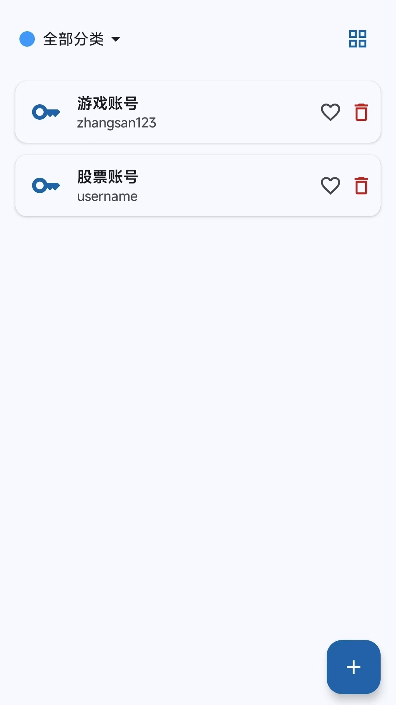
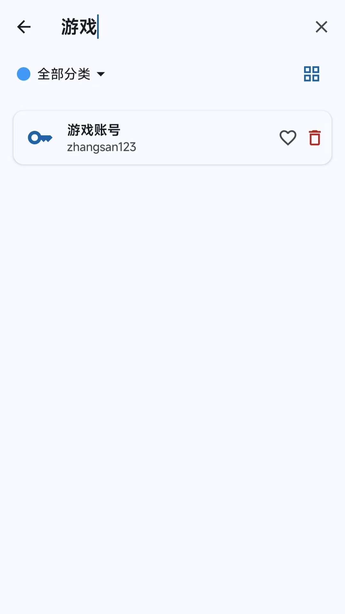
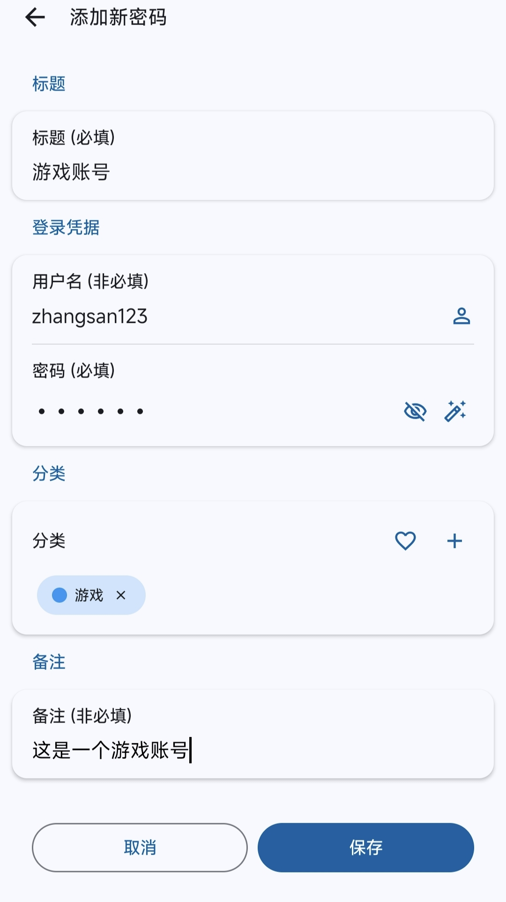
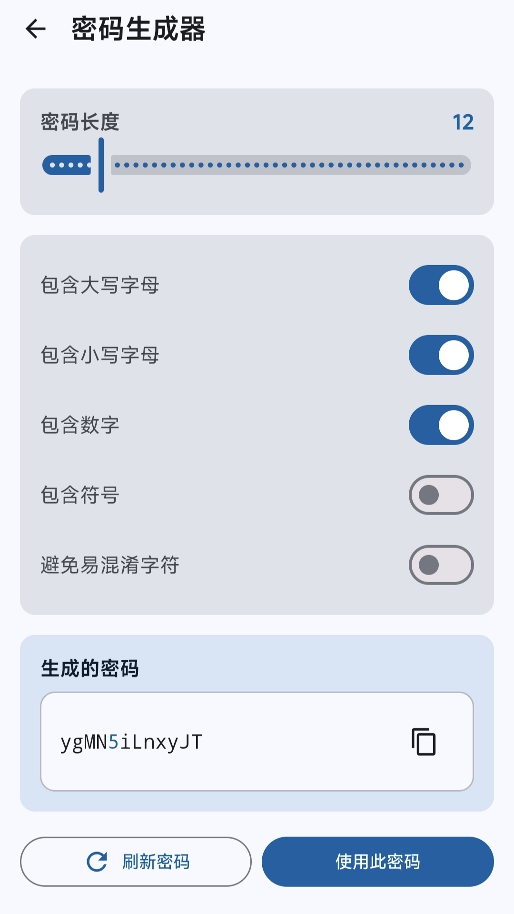
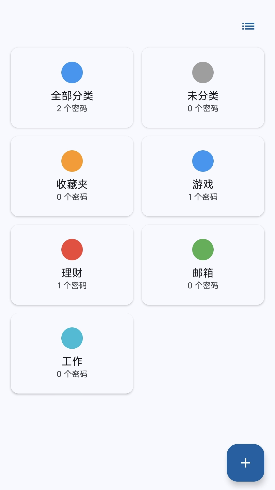
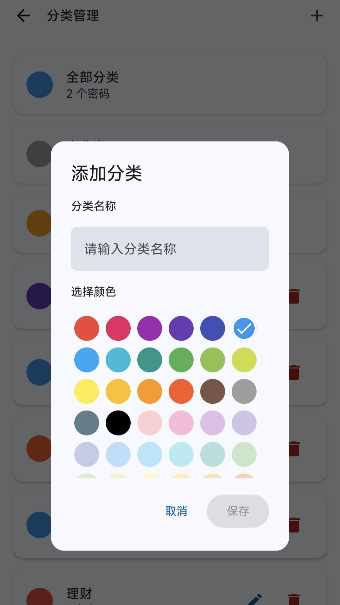
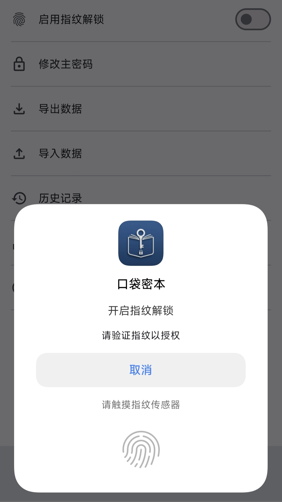

<p align="center">
  
</p>

<p align="center">
  <strong>严格离线、零网络权限、开源透明的 Android 本地密码管理器</strong>
</p>

<p align="center">
  <a href="https://github.com/greyfreedom/PocketVault/actions/workflows/ci.yml"></a>
  <a href="https://github.com/greyfreedom/PocketVault/tags"></a>
  <a href="./LICENSE"></a>
  <a href="./app/build.gradle.kts"></a>
  <a href="./SECURITY.md"></a>
</p>

<p align="center">
  <a href="https://play.google.com/store/apps/details?id=com.turisla.hellopocket"></a>
</p>

<p align="center">
  <a href="README.md">English</a> · <strong>简体中文</strong> ·
  <a href="../../releases">GitHub Releases</a> ·
  <a href="docs/privacy_policy.html">隐私政策</a> · <a href="SECURITY.md">安全政策</a> ·
  <a href="CONTRIBUTING.md">参与贡献</a> · <a href="LICENSE">Apache-2.0</a>
</p>

---

PocketVault（口袋密本）是一款完全在 Android 设备本地运行的密码管理器。应用不申请 `android.permission.INTERNET`，不包含广告、分析、遥测或崩溃上报 SDK，也没有账号系统和远程服务器。

保险库数据在设备上加密和处理。只有当用户主动选择导出或分享备份时，数据才会交给 Android 系统文件选择器或分享面板所选的目标应用。

> [!IMPORTANT]
> 开源和离线运行能够降低风险，但不代表“绝对安全”。使用前请阅读[安全模型与限制](#安全模型与限制)和 [SECURITY.md](SECURITY.md)。

> [!NOTE]
> 本仓库中的严格离线声明适用于 2.4.0 及更高版本。商店发布过渡期间，Google Play 可能暂时仍提供旧版本；请核对已安装版本及其对应源码 tag。迁移说明见[更新日志](CHANGELOG.md)。

> [!WARNING]
> 2.5.0 仅接受当前带完整认证信息的 V2 保险库格式。缺少当前完整性、绑定或 KDF 元数据的 V1 和早期 V2 保险库会被拒绝，不再原地迁移。旧版本用户应先使用 2.4.0 解锁保险库并导出一份新的 `.hpb` 备份；在卸载或替换 2.4.0 前，请保留原始数据并确认新备份可用。

## 核心特性

- **严格离线**：没有网络权限，没有 Firebase、广告、用户行为统计或远程日志。
- **密码与安全笔记**：本地保存密码、用户名、备注、安全笔记、分类、收藏和加密附件。
- **TOTP 验证码**：支持手动添加或使用可选相机权限扫描二维码，二维码只在设备本地处理。
- **本地整理**：支持多分类、收藏、列表/网格视图，以及可搜索标题、账号、密码备注和安全笔记内容的独立搜索页面。
- **密码生成器**：支持长度、字符集、易混淆字符排除和密码短语。
- **生物识别快捷解锁**：使用 Android Keystore 保护的本地密钥包装机制。
- **本地备份与恢复**：支持加密导出、导入和最多 5 份、总计最多 1 GiB 的自动备份历史。
- **敏感界面保护**：全局 `FLAG_SECURE`、后台自动锁定、剪贴板敏感标记和定时清除。
- **7 种语言**：英语、简体中文、西班牙语、印地语、韩语、葡萄牙语和越南语。

## 应用截图

截图使用演示数据，不包含真实凭据。点击任意截图可打开 [`pictures/zh`](pictures/zh/) 中的原图。

<p align="center">
  <a href="./pictures/zh/listpass.jpeg"></a>
  <a href="./pictures/zh/search.jpeg"></a>
  <a href="./pictures/zh/addpass.jpeg"></a>
  <a href="./pictures/zh/gene.jpeg"></a>
</p>

<p align="center">
  <a href="./pictures/zh/list_category.jpeg"></a>
  <a href="./pictures/zh/category.jpeg"></a>
  <a href="./pictures/zh/fingerprint.jpeg"></a>
</p>

## 安全设计

PocketVault 采用“主密码包装随机数据密钥”的设计：

1. 新建保险库时生成随机盐和随机 Google Tink `StreamingAead` Keyset。
2. 使用 PBKDF2-HMAC-SHA256 从主密码派生密钥加密密钥。新建和改密后的保险库使用 600,000 次迭代，受支持的保险库配置也必须声明不低于该工作因子。
3. 派生密钥只用于包装随机 Keyset；主密码、派生密钥和明文 Keyset 都不会持久化。
4. 密码、分类、TOTP、清单和附件使用 Google Tink Streaming AEAD（AES-256-GCM-HKDF）加密。
5. 修改主密码时只重新包装 Keyset，不需要重新加密全部保险库内容。
6. 生物识别只是一种便利解锁方式：Android Keystore 密钥在系统认证后解包 Keyset，主密码仍是保险库恢复的唯一信源。

项目还包含认证加密、关联数据绑定、语义完整性校验、安全导入限制、Zip Slip 防护、原子文件提交和会话失效保护。更详细的边界与报告方式见 [SECURITY.md](SECURITY.md)。

## 备份元数据

导出的 `.hpb` 文件中，密码、笔记、TOTP、分类、附件和加密清单受到 AES-256-GCM 保护；但备份容器不是完全不透明的。

可读取的 `vault_v2.json` 配置包括：

- 密码提示；
- 随机盐和 KDF 参数；
- 加密后的 Tink Keyset；
- 版本、保险库标识和完整性绑定所需元数据。

请勿在密码提示中填写敏感信息，并妥善保存导出的备份。受支持的备份仍需要创建它时使用的主密码；从 2.5.0 开始，备份必须已经采用上文所述的当前认证 V2 格式。应用没有账号、托管密钥或主密码找回服务。

## 安全模型与限制

PocketVault 主要防护设备或文件丢失后对应用私有文件和导出备份的离线读取，并尽量降低日常使用中的截屏、剪贴板和后台暴露。

以下场景不应被视为已完全防护：

- 已 Root、被恶意软件控制或系统本身遭到入侵的设备；
- 恶意键盘、无障碍服务或用户主动授权的高权限应用；
- 容易猜测或已泄露的主密码所面临的离线暴力破解；
- 用户主动分享至不安全位置的备份；
- 未发现的实现错误、依赖漏洞或供应链攻击；
- 与公开源码不对应、签名来源不明的安装包。

## 安装

Google Play 与本仓库的 GitHub Releases 分发同一个正式应用身份：

[在 Google Play 获取 PocketVault](https://play.google.com/store/apps/details?id=com.turisla.hellopocket)

[从 GitHub Releases 下载 Play 签名的 Universal APK](../../releases)

两个渠道都使用 `com.turisla.hellopocket` 和同一个 Play App Signing 证书：

| 渠道 | 发布产物 | 应用身份 |
| --- | --- | --- |
| Google Play | Play 根据正式 AAB 生成的设备优化 APK | `com.turisla.hellopocket`、Play App Signing |
| GitHub Release | 从同一个 AAB 的 Play Console 记录下载的已签名 Universal APK | 完全相同的包名和签名证书 |
| 本地 Debug | 添加 `.debug` 后缀的开发构建 | `com.turisla.hellopocket.debug`、仅使用调试签名 |

因此 Google Play 和 GitHub 安装包属于同一个应用，不能同时安装，并且在符合 Android 版本规则时可以相互升级。仅有相同包名不能证明来源可信，还应核对签名证书指纹和文件哈希。

GitHub 附件必须是从 Play Console 下载的已签名 Universal APK，不能使用 upload key、其他本地 release key 或 debug key 签名的本地产物。每次发布应公开精确 commit 与签名 tag、版本对应关系、AAB SHA-256、Universal APK SHA-256 和 Play App Signing 证书指纹，具体检查清单见 [RELEASING.md](RELEASING.md)。

## 从源码构建

环境要求：

- Android Studio 或 Android SDK Command-line Tools；
- Android SDK 36；
- JDK 17 编译工具链；Gradle 可运行于 JDK 17–25（已验证 Android Studio 内置 JBR 25）；
- Git。

克隆仓库后无需 Firebase 配置，也不需要 `google-services.json`：

```bash
# 编译两个渠道共用的源码 variant
./gradlew :app:compileGooglePlayDebugKotlin

# 单元测试与静态检查
./gradlew :app:testGooglePlayDebugUnitTest
./gradlew :app:lintGooglePlayDebug
```

需要本地安装调试版时可执行：

```bash
./gradlew :app:installGooglePlayDebug
```

安装后的调试包 ID 是 `com.turisla.hellopocket.debug`，可以与正式版共存。项目不再维护独立的 GitHub flavor；GitHub 可安装版本由 Play App Signing 根据同一个 `googlePlayRelease` AAB 生成。上传 AAB 的签名配置从仓库根目录未跟踪的 `keystore.properties` 读取；切勿提交 keystore、签名密码、`local.properties` 或个人环境配置。

## 技术栈与目录

- Kotlin、Jetpack Compose、Material 3
- MVVM、StateFlow、Koin、类型安全 Compose Navigation
- Google Tink Streaming AEAD
- Kotlinx Serialization、Protocol Buffers
- Coil 本地图片/视频缩略图
- kotlin-onetimepassword、ZXing

```text
app/src/main/java/com/turisla/hellopocket/
├── data/       # 保险库、备份、偏好和 Repository
├── model/      # 保险库与 UI 数据模型
├── security/   # Tink、Android Keystore、生物识别和会话管理
├── ui/feature/ # Compose 功能页面
├── router/     # 类型安全路由
└── di/         # Koin 模块
```

## 参与贡献

- 请先阅读 [CONTRIBUTING.md](CONTRIBUTING.md)，普通 Bug、功能建议和文档改进可以提交 Issue 或 Pull Request。
- 可能暴露保险库、绕过认证、削弱加密或影响恶意备份处理的问题，请先按照 [SECURITY.md](SECURITY.md) 私下报告。
- 测试只能使用合成数据；不要上传真实保险库、凭据、备份或未脱敏的敏感日志。
- 新增用户可见文案必须同步更新全部 7 个语言目录。

## 许可证

源代码采用 [Apache License 2.0](LICENSE) 发布。署名信息见 [NOTICE](NOTICE)，依赖许可证见[第三方许可说明](THIRD_PARTY_NOTICES.md)，项目名称与图片物料使用说明见 [TRADEMARKS.md](TRADEMARKS.md)。Apache-2.0 不授予对 PocketVault/口袋密本名称、Logo 或其他品牌标识的商标权利。
